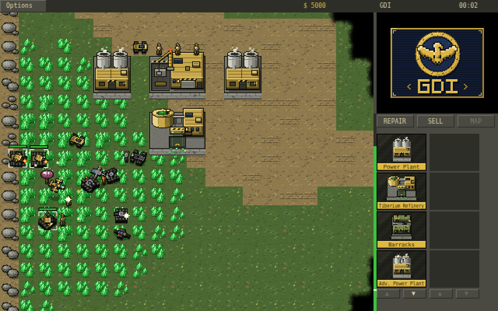
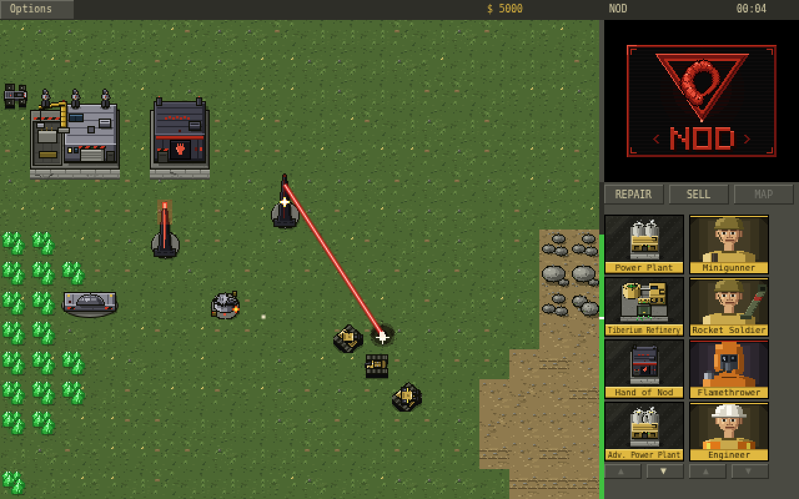
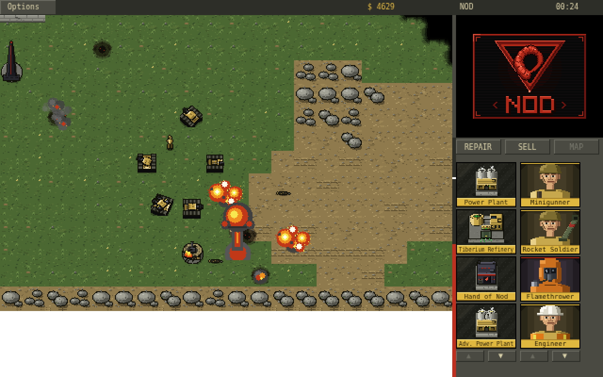
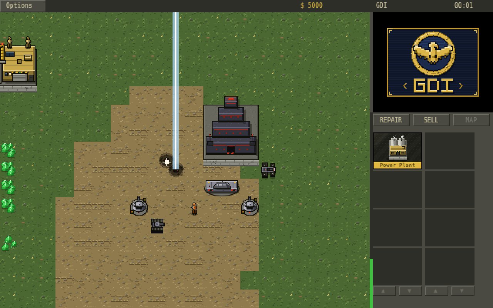
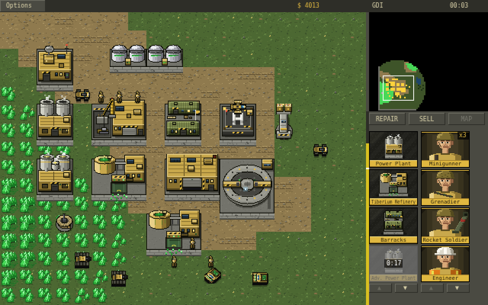

# Tiberian Dawn Clone

A from-scratch, browser-based clone of the 1995 RTS classic *Command & Conquer*
(Tiberian Dawn). All code, pixel art, and sound are **original** — the art is
drawn procedurally on canvases at load time and the audio is synthesized with
WebAudio (EVA and unit voices use the browser's speech synthesis). The game
mechanics, unit roster, prices, and presentation follow the original as closely
as possible.

## Screenshots

| | |
|---|---|
|  |  |
|  |  |
|  |  |

## Running it

No build step, no dependencies. Serve the folder and open it:

```sh
cd cnc_fable5
python3 -m http.server 8000
# then open http://localhost:8000
```

(Opening `index.html` directly with `file://` also works in most browsers.)

Pick your side — Global Defense Initiative or Brotherhood of Nod — and destroy
the enemy base. You start with an MCV: click it twice to deploy your
Construction Yard.

Handy URL parameters for testing: `?side=gdi&seed=42&nomenu=1&mute=1`.

## Controls (classic 1995 scheme)

| Input | Action |
|---|---|
| Left-click | Select unit/building; with units selected: click ground = move, click enemy = attack, click tiberium with a harvester = harvest |
| Left-drag | Band-box select units |
| Left-drag with a wall ready | Place a whole run of wall segments (extra segments charge on placement) |
| **Right-click** | **Deselect / cancel mode** (no right-click orders — just like the original) |
| Shift+click | Add/remove from selection |
| Double-click | Select all visible units of that type |
| Click selected MCV (or `D`) | Deploy into Construction Yard |
| Alt+1..9 (or Ctrl+1..9) | Assign control group — Alt is the reliable one; browsers steal Ctrl+1..8 for tab switching |
| 1..9 | Recall group (double-tap to center camera, Shift adds the group to the selection) |
| `H` | Center on Construction Yard |
| `S` / `G` | Stop / guard |
| `T` | Select same type on screen |
| Arrow keys / screen edges | Scroll the map |
| Two-finger touchpad scroll (or mouse wheel) | Pan the map |
| `Esc` | Options menu / cancel placement, sell, repair, targeting |

Sidebar: left icon strip is structures, right strip is units. Click an icon to
start building (cost drains as it builds, remaining time shows on the icon);
click a finished structure icon to place it. Unit icons can be clicked
repeatedly to **queue up to 20 units** (the badge shows the count) — a
deliberate departure from the original. Left-click an in-progress structure
icon to pause it, right-click any icon to cancel/dequeue with refund. REPAIR
and SELL buttons toggle wrench/sell cursor modes. The radar comes online with
a powered Communications Center.

## What's simulated

- **Tiberium economy** — harvesters (700 credits a load), refineries with
  docking, silos, storage caps, spreading tiberium fields seeded by blossom
  trees, infantry take damage crossing fields
- **Power** — low power halves production speed, kills the radar, and disables
  the Obelisk, Advanced Guard Tower, and SAM sites
- **Construction** — the classic sidebar with clock-wipe cameos, adjacency
  placement rules, incremental payment, hold/cancel with refund
- **Full roster** — Minigunner, Grenadier, Rocket Soldier, Flamethrower, Chem
  Warrior, Engineer (captures buildings), Commando; Hum-Vee, Buggy, Recon Bike,
  APC, Light/Medium/Mammoth/Flame/Stealth Tanks, Artillery, Rocket Launcher,
  Harvester, MCV; Orca and Apache with helipad rearming; Nod vehicles arrive by
  cargo plane at the Airstrip
- **Defenses** — Guard Tower, Advanced Guard Tower, Gun Turret, SAM Site, and
  the Obelisk of Light with its charge-up laser; concrete walls place in
  drag-runs, auto-connect, and block movement
- **Superweapons** — GDI Ion Cannon (Advanced Comm. Center) and the Nod nuclear
  strike (Temple of Nod)
- **Combat details** — warhead vs. armor tables, turret rotation, homing
  rockets, artillery arcs, splash damage with friendly fire, tanks crush
  infantry, stealth tank cloaking, Mammoth self-repair
- **Fog of war** — permanent-reveal black shroud, jagged edges, radar minimap;
  enemy blips on the radar need live line-of-sight from your own forces
- **Visceroids** — infantry that die on a tiberium field mutate into hostile
  creatures that attack everyone
- **Auto-repair** — damaged buildings start repairing themselves (toggleable
  with the REPAIR button); wading through tiberium hurts infantry, standing
  still in it doesn't
- **Skirmish AI** — plans its base by role (power tucked behind, refineries at
  the tiberium, defense arc facing you), keeps its economy and unit lines
  running, masses each attack at a staging point before striking on a
  sustained 2-4 minute cadence that scales up, garrisons its home, and fires
  its superweapon at your densest cluster
- **EVA** — "Construction complete", "Unit ready", "Low power", "Base under
  attack", "Silos needed"… spoken via speech synthesis, plus synthesized
  weapon/explosion sound effects

## Not included (yet)

Campaign missions and FMV, multiplayer, naval units, save/load, difficulty
levels.

## Experimental: pre-rendered 3D sprite pipeline (unused)

`tools/render3d/` holds an experimental Westwood-style pipeline (low-poly
models rendered headlessly by Blender/Cycles into sprite sheets). The game
does not use it — all shipping art is the procedural pixel art.
