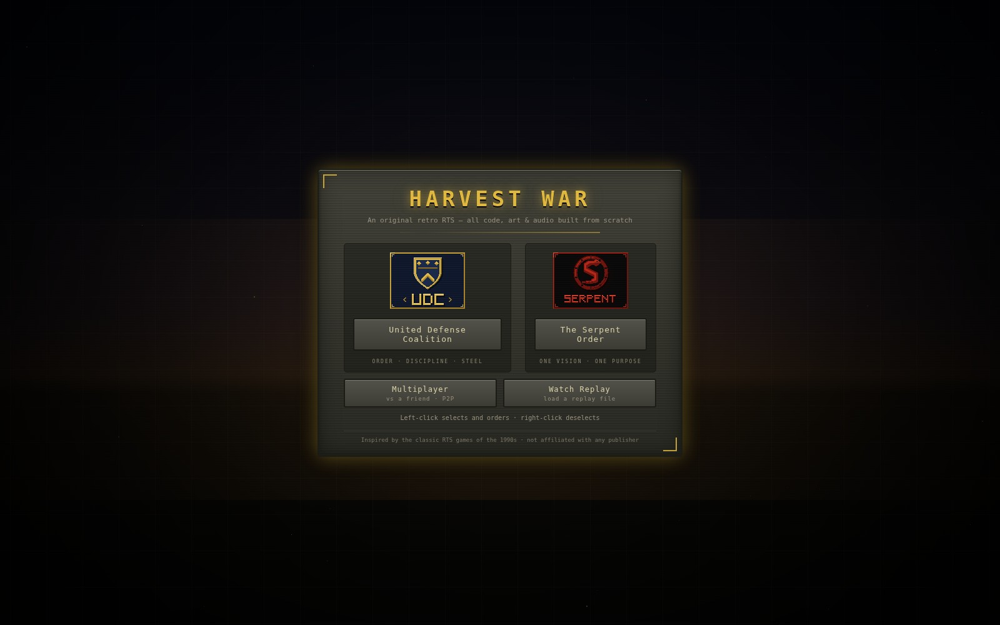
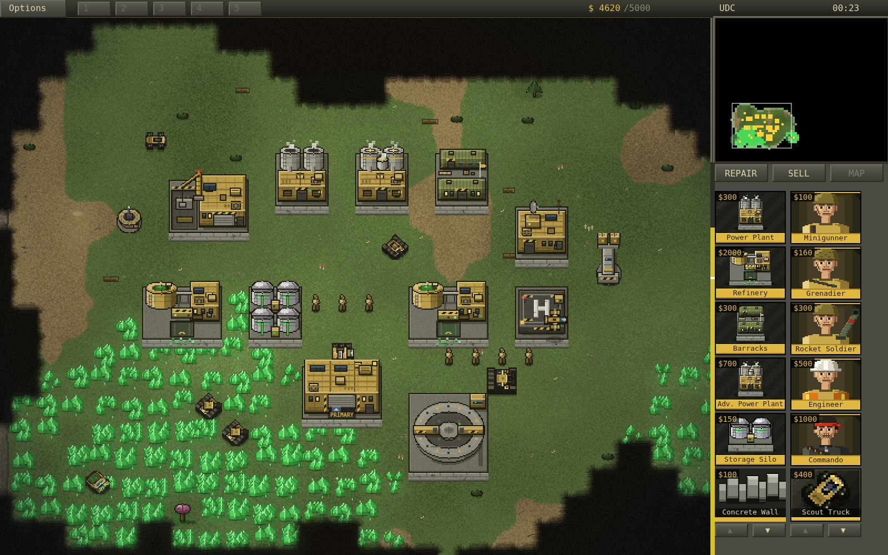
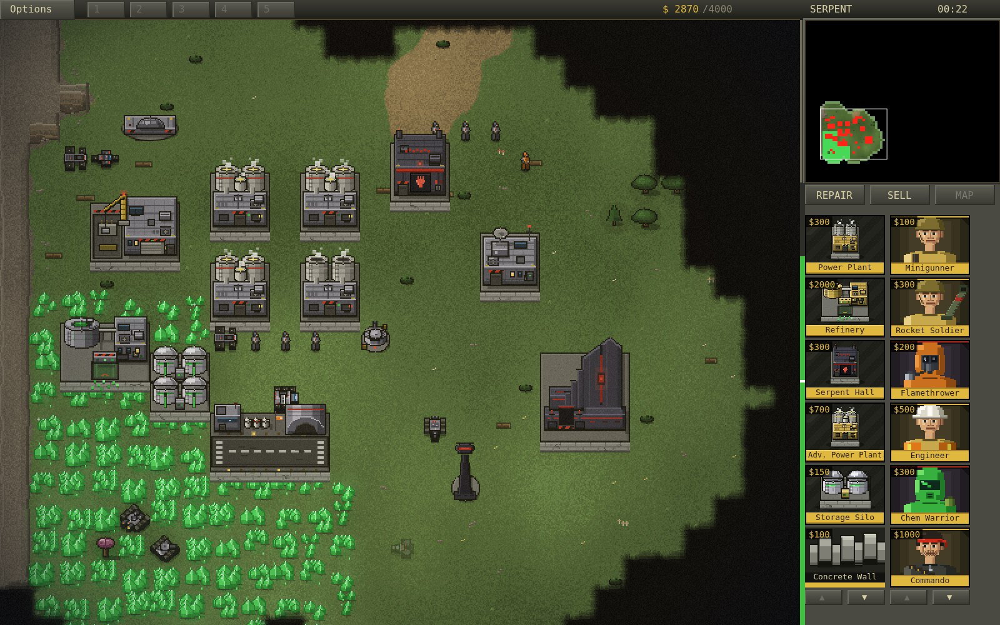
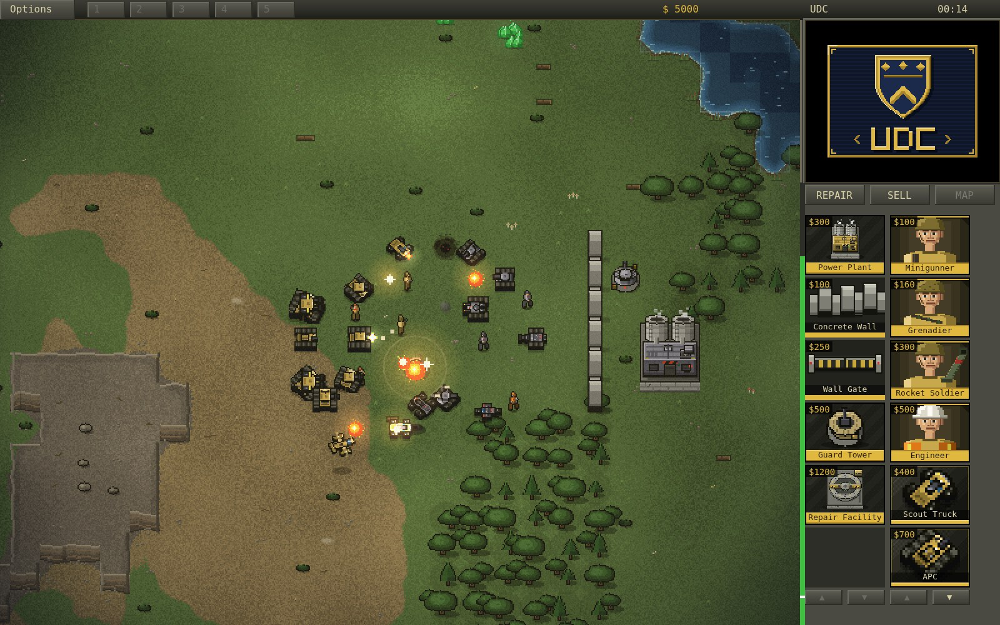
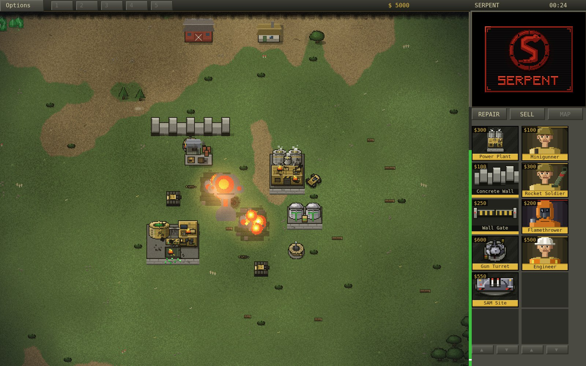
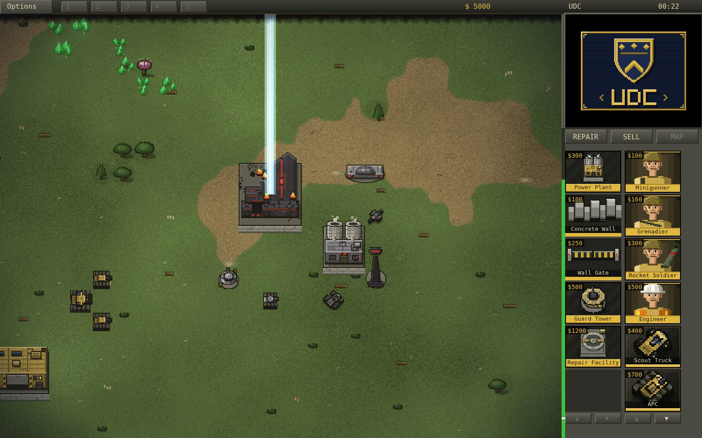
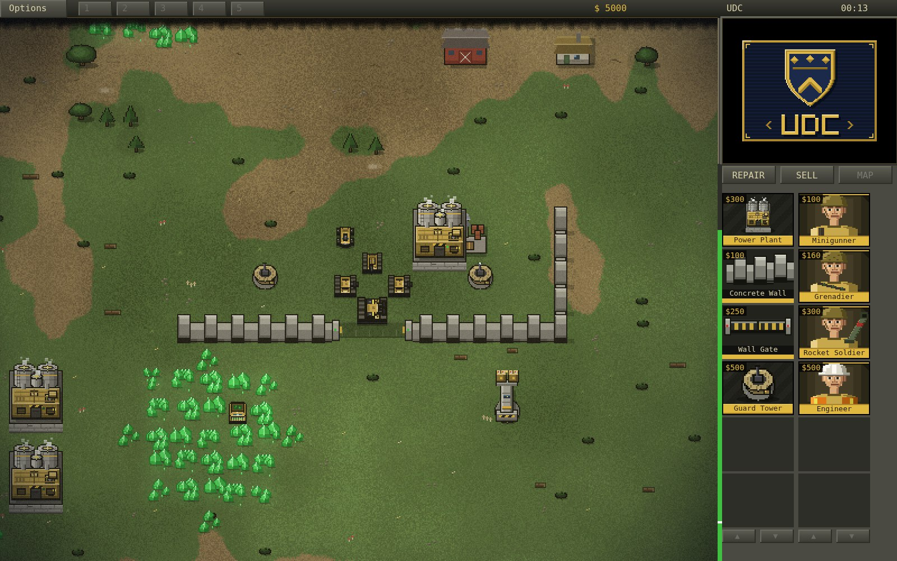
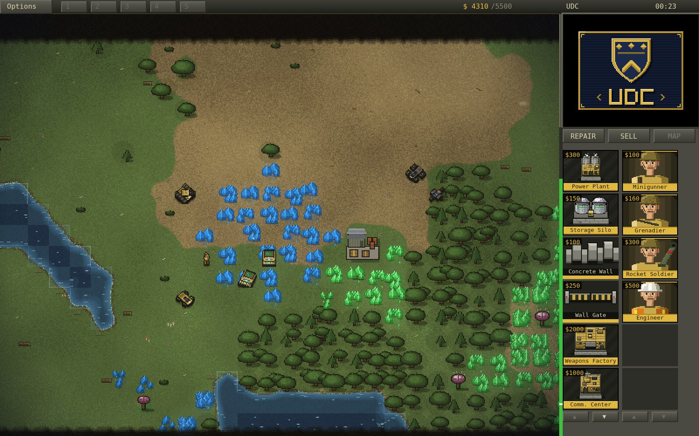

# Harvest War

An original, from-scratch, browser-based real-time strategy game in the
mid-90s style. All code, pixel art, and sound are **original** — the art is
drawn procedurally on canvases at load time and every sound, including the
tactical announcer and unit chatter, is synthesized live with WebAudio (no
recordings, no browser text-to-speech). Inspired by the classic RTS games of
the 1990s; not affiliated with, endorsed by, or connected to any other game
or publisher.

## Screenshots

| | |
|---|---|
|  |  |
|  |  |
|  |  |
|  |  |

## Running it

No build step, no dependencies. Serve the folder and open it:

```sh
cd harvestwar
python3 -m http.server 8000
# then open http://localhost:8000
```

(Opening `index.html` directly with `file://` also works in most browsers.)

Pick your side — United Defense Coalition or The Serpent Order — then pick
your battle: a **skirmish** on a random map, or one of eight **campaign
operations**, each with its own briefing, fixed battlefield, objective and
scripted mission events (annihilation, a harvest quota, a timed last stand,
an economy hunt, a stronghold assault, a no-base convoy escort, a
capture-it-intact heist, and a fortress finale). Winning an operation
unlocks the next; progress is saved in your browser. You start with an MCV:
click it twice to deploy your Construction Yard.

Handy URL parameters for testing: `?side=gdi&seed=42&nomenu=1&mute=1&mission=2`.

## Multiplayer (P2P, no server)

The **Multiplayer** button on the menu starts a 1v1 against another human,
directly browser-to-browser over WebRTC — there is no game server and no
account:

1. The **host** picks a faction, clicks *Host Game*, and sends the generated
   **invite code** to the opponent over any chat (codes are short — ~350
   characters — the boilerplate of the WebRTC handshake is rebuilt on the
   receiving end and the rest travels compressed).
2. The **guest** clicks *Join Game*, pastes the invite code, and sends back
   the generated **reply code**.
3. The host pastes the reply code, clicks *Connect*, and the match starts on
   both screens — the guest automatically gets the other faction, and both
   players start symmetrically with an MCV and escort.

Under the hood it is a classic deterministic-lockstep RTS netcode: both
browsers run the identical simulation and only your orders travel the wire,
so bandwidth is tiny. Notes:

- If one player lags or pauses, the other sees *WAITING FOR OPPONENT…* until
  they catch up. Disconnecting or aborting forfeits the match.
- Both players should run the **same browser** (e.g. both Chrome) — the sims
  are checksummed against each other and a divergence ends the match with a
  desync notice.
- Connection uses a public STUN server for NAT traversal; on a strict
  symmetric-NAT network the direct connection may fail (there is no relay).
  Same LAN always works.
- For fun/testing on one machine: open two tabs of
  `?mpbc=room1&mphost=1&side=gdi` and `?mpbc=room1` — they connect through a
  local channel, no network at all.

## Controls (classic 1995 scheme)

| Input | Action |
|---|---|
| Left-click | Select unit/building; with units selected: click ground = move, click enemy = attack, click chrysalite with a harvester = harvest |
| Left-drag | Band-box select units |
| Left-drag with a wall ready | Place a whole run of wall segments (extra segments charge on placement) |
| **Right-click** | **Deselect / cancel mode** (no right-click orders — classic-RTS convention) |
| Ctrl+click | Focus fire: force-attack ANY unit or building (friend, foe or neutral) |
| `A`, then click ground (or Ctrl+click open ground) | **Attack-move**: sweep to the spot, engaging every enemy met on the way |
| Shift+click | Add/remove from selection |
| Double-click | Select all visible units of that type |
| Click selected MCV (or `D`) | Deploy into Construction Yard |
| Select infantry, click a friendly APC | Board it (up to 5 passengers) |
| Select vehicles, click your Repair Facility | Drive to the pad and repair (costs credits) |
| Select armed infantry, click a village building | Garrison it and fire from the windows |
| Click the selected garrisoned building (or `U`) | Order the squad back out |
| Select an engineer, click a Supply Depot | Capture it for a credit trickle |
| Click the selected loaded APC (or `U`) | Unload its passengers |
| Alt+1..9 (or Ctrl+1..9) | Assign control group — Alt is the reliable one; browsers steal Ctrl+1..8 for tab switching |
| 1..9 | Recall group (double-tap to center camera, Shift adds the group to the selection) |
| Tab-bar chips 1-5 | Click to recall that group (twice centers); right-click to assign the current selection |
| Click the selected factory again | Make it the primary factory for its kind (same as `P`) — a gold PRIMARY tag marks it; works for the Barracks, vehicle factory and Helipad |
| `H` | Center on Construction Yard |
| `S` / `G` | Stop / guard |
| `T` | Select same type on screen |
| `E` | Select every unit on screen except harvesters |
| `Space` | Jump the camera to the latest radar alert (base attacked, harvester in trouble, incoming superweapon) |
| `P` | Set the selected factory building as primary for its kind |
| Shift+click a unit icon | Queue 5 at once (Shift+right-click cancels the whole batch) |
| Arrow keys / screen edges | Scroll the map |
| Right-click and drag | Grab and pan the map (best way to scroll in a browser window) |
| Two-finger touchpad scroll (or mouse wheel) | Pan the map |
| `Esc` | Options menu / cancel placement, sell, repair, targeting |
| `F1` (or `?`) | Pause and open the in-game controls reference (also on the Options menu) |

Hovering any sidebar build icon pops a tooltip with the item's name,
cost, a one-line role description, and its power contribution or drain.

### Touch (phones & tablets)

The game is playable from a mobile browser — landscape strongly recommended:

| Gesture | Action |
|---|---|
| Tap | Same as left-click: select, order, tap icons and buttons |
| One-finger drag | Pan the map (in placement mode it moves the building ghost instead; with a wall ready it draws the wall run; on the radar it scrubs the camera; on the build strips it scrolls them) |
| Long-press, then drag | Band-box select — touch boxes **add** to the current selection |
| Tap a unit already in a multi-selection | Drop it from the group (the Shift-click substitute) |
| Long-press a sidebar icon | Cancel/dequeue production (the right-click equivalent) |
| Tab-bar chips 1-5 | Tap to recall that control group (twice centers); long-press to assign the current selection |
| Two-finger tap | Deselect / cancel mode (the right-click equivalent) |
| Two-finger drag | Pan the map in any mode |
| Tap selected MCV again | Deploy into Construction Yard |
| Tap selected loaded APC again | Unload its passengers |
| Tap selected factory again | Make it the primary factory for its kind |

Small chrome controls (Options, REPAIR/SELL, strip arrows) accept
near-miss taps — a slop zone snaps them to the target. Edge scrolling
and the in-game cursor are mouse-only; on touch the pan gesture
replaces them.

On touch devices the layout adapts to the device's real aspect ratio:
the sidebar keeps its size on the right edge and the battlefield
viewport widens to use every pixel of screen width (desktop keeps the
classic fixed 16:10 frame).

**Getting rid of the mobile browser bar** works in three layers, since
no single mechanism covers every phone:

1. Picking a faction on a touch device requests fullscreen via the
   Fullscreen API (where the browser honors it).
2. If the address bar is still there, a **"Swipe up to hide the browser
   bar"** overlay appears — mobile browsers only collapse the bar in
   response to a real page scroll, which the game normally swallows, so
   this overlay lets exactly one swipe through as a genuine scroll. The
   page is kept one bar-height taller than the visible viewport for
   this purpose; once the bar collapses there is nothing left to scroll
   and the game locks the viewport again.
3. Best of all: the game is an installable **PWA** (manifest + service
   worker + icons). Use the *Install as App* button on the menu when
   the browser offers it, or *Add to Home Screen* — launched that way
   it runs truly fullscreen with no browser chrome at all, and works
   offline too.

The Options menu (`Esc` or the top-left tab) has a
**Fullscreen / Maximize Screen** button to redo any of this by hand.
Desktop mouse users never get fullscreen forced on them.

Sidebar: left icon strip is structures, right strip is units — every icon
shows its credit cost. Click an icon to start building (cost drains as it
builds, remaining time shows on the icon); click a finished structure icon to
place it. Unit icons can be clicked repeatedly to **queue up to 20 units**
(the badge shows the count) — a quality-of-life touch.
Infantry, vehicles, and aircraft each build on their own concurrent line, so
a Barracks and a War Factory (or Airstrip) run at the same time; owning more
than one factory of a kind speeds that line up, and `P` designates which one
new units spawn from. Left-click an in-progress structure icon to pause it,
right-click any icon to cancel/dequeue with refund. REPAIR and SELL buttons
toggle wrench/sell cursor modes. The radar comes online with a powered
Communications Center; owning more than one Advanced Comm. Center or Serpent
Temple charges the Orbital Lance / nuke proportionally faster.

## What's simulated

- **A painted world with real geography** — every map grows from a hidden
  elevation field, so the landscape makes sense: the river traces the
  valley floor and bends around the highland the enemy base sits on, rock
  crowns the ridgelines with talus skirts weathering to dirt below, dense
  gallery woods hug the riverbanks while groves and meadows share the
  lowlands, ponds pool in genuine depressions, chrysalite collects in the
  valley bottoms, and worn roads run from the village to the ford. The
  ground itself is rendered per-pixel with world-space noise — grass,
  dirt, water and rock blend with ragged organic edges instead of tile
  seams — plus fordable crossings, a timber bridge, an animated waterfall
  at the rocky rim, eroded mesa cliffs, and scattered doodads. Buildings
  and vehicles draw in true depth order, so a tank rolling behind a guard
  tower disappears behind it instead of driving over its roof
- **P2P multiplayer** — 1v1 deterministic-lockstep netcode over a WebRTC data
  channel with copy-paste matchmaking codes: serverless, accountless, and
  checksummed against desyncs (see the Multiplayer section above)
- **A campaign** — eight operations per side with in-universe briefings,
  distinct objectives, and **scripted mission events**: timed and
  conditional radio calls, reinforcement columns rolling in off the map
  edge, enemy raids announced by direction, supply drops, fleshling
  migrations, and revenge waves when you hit what the enemy loves.
  Annihilate an outpost; amass a 6000-credit war chest (held at once —
  build silos) while raiders hunt your harvesters; survive fifteen minutes
  of announced, escalating assaults on a walled plateau, through to a
  final all-out wave; hunt down an economy that punches back; crack a
  stronghold under a charging superweapon with a reinforcement drip;
  escort an irreplaceable transport down a checkpoint-lined valley road
  with no base at all (a pulsing beacon marks the goal); capture a
  superweapon facility INTACT — one stray shell fails the mission; and
  finally bring down a fully-built fortress that has been waiting for you.
  Each op tunes the AI's aggression and war chest, wins unlock the next,
  and an objective chip on the HUD tracks live progress
- **A civilian hamlet you can fight over** — farmhouse, cottages, a barn
  and a little chapel, with villagers who wander about and flee gunfire;
  nobody auto-targets them (except the fleshlings), but Ctrl+click will.
  **Armed infantry can garrison the buildings** and fire from the windows
  (with a +1 range height advantage) — the structure flies your colors
  while occupied, click it again to order everyone out, and if it
  collapses the squad goes with it. Rumor says the chapel's collection
  box survives its demolition — a guaranteed cash crate in the rubble,
  if your conscience allows
- **Neutral supply depots** — two abandoned depots sit on contested ground
  near the river crossings and midfield. Send an engineer to capture one
  and it pays a steady credit trickle for as long as you hold it; the
  enemy can shell it or steal it right back. Suddenly the middle of the
  map is worth owning
- **Replays** — every single-player battle records itself (the sim is
  deterministic, so a replay is just the seed and your orders — a few
  kilobytes). Watch the battle again from the score screen, save it to a
  file, or load one from the main menu and watch any battle re-simulate
  move for move. Playback is a spectator's view: the whole map renders
  unfogged, both sides visible, cloaked ambushers included
- **The observer's booth** — watching an AI battle or a replay, the radar
  minimap is always on (no Comm Center needed) and you can hop between
  commanders' seats — press **V** or click the ◀ ▶ chip in the top bar —
  to see each army's build queues, treasury and power from their side of
  the war
- **Save & resume** — pause any single-player battle and hit *Save Battle*;
  the main menu then offers *Resume Battle*, which re-simulates your
  recording at fast-forward (a progress bar counts it up) and hands the
  controls back at the exact moment you left — same units, same credits,
  same fog. A resumed battle keeps recording, so you can save again or
  watch the whole thing later
- **A harder HARD** — the top-difficulty AI plays the whole map: it chases
  crates, captures supply depots with engineers, garrisons village houses,
  guards its refineries, expands to a second base by a rich crystal field,
  masses proper attack waves instead of trickling units, and micro-manages
  its army — focus-firing your weakest units and pulling wounded armor back
  to the repair pad. And no AI goes quietly anymore: a bankrupt army sells
  its buildings to fund one last push — then sells everything and rushes
- **Skirmish setup** — dial a skirmish in before you launch: combatants
  (classic duel, free-for-alls against 2 or 3 AIs, or sit back and **watch
  2–4 AI armies fight each other**), map size (classic or large), starting
  funds (3000–12000), crates on/off, superweapons on/off, and a battlefield
  seed you can type in to refight a favorite map — the pause menu shows the
  current seed so you can share it
- **Four armies on one field** — the extra combatants fly recolored
  faction banners: UDC Azure in steel blue and the Serpent Amethyst in
  royal violet, so a four-way brawl reads at a glance
- **A frontier worth fighting for** — Large maps scale their riches with
  their size: crystal fields scattered across the whole interior (plus a
  second blue pocket hidden in the wilds), deeper home fields, a second
  outlying hamlet, up to four supply depots, more ponds, groves and
  boulder outcrops — and the radar draws it all at the right scale
- **Armies, not patrols** — the AI masses its attacks: fresh units join a
  gathering wave instead of loitering at home, skirmish waves run bigger,
  and buildings hit by superweapons get repaired when the treasury allows
- **Field discipline** — group orders fan out into cluster formations
  instead of single-file conga lines (yours and the AI's), gunships strike
  refineries and factories rather than sandbags — and fly home instead of
  hovering over your base — the AI's expansion MCV picks buildable ground
  beside the crystal (not in it) and travels with an escort, every AI
  difficulty grabs convenient crates, held supply depots pay a trickle
  that's actually worth capturing, and river bridges are two lanes wide so
  harvester traffic stops wedging head-to-head
- **Campaign records** — each operation remembers your fastest win and best
  score, shown on the operations list and stamped NEW BEST on the tally
- **Multiplayer rematch** — the connection stays up at the score screen:
  both players hit *Rematch* and a fresh battlefield launches instantly,
  no new codes to paste
- **Volume sliders** — separate SFX, music and voice levels in the options
  menu, remembered across sessions
- **Vehicle repairs** — click your Repair Facility with vehicles selected
  and they roll over and park; a wrench blinks while the pad patches them
  up at the same credits-per-point rate building repairs cost
- **Original soundtrack** — twelve synthesized tracks in the dark mid-90s
  RTS style, sequenced live with WebAudio — and each faction fights to its
  own score: the Coalition marches to the original eight, while the Serpent
  Order gets four tracks of its own — driving phrygian bass pumps,
  octave-jump riffs, a 134 bpm gallop, and hooks that circle back like the
  snake on their banner. Toggle with Music: ON/OFF in the options menu
- **A graded, luminous look** — the whole battlefield sits under a cinematic
  colour grade and vignette that fuse the procedural sprites into one lit
  scene, with a whisper of film grain to kill banding. Bright things
  genuinely glow: energy beams bloom hot cores onto the ground, explosions
  flash-bloom white then ember-orange, muzzle flashes halo, and chrysalite
  fields give off a radioactive haze. Rivers have depth — dark channels,
  bright turquoise shallows, and a shimmering foam line where water meets
  land. The HUD is lit brushed metal framed by a gold seam, and the menu
  sits over a slow dawn war-room — drifting tactical grid, embers, corner
  brackets, faction-tinted glow — instead of a black void
- **Feedback that feels good** — orders answer with collapsing green/red
  destination rings, hits flash white, harvest deliveries pop floating
  credit counters, and wounded buildings and vehicles trail smoke. Units
  cast soft contact shadows, vehicles kick up dust on dirt roads, big
  explosions throw a shockwave ring and tumbling debris, sunlight glints
  off the river, and the crystal fields sparkle. Battles leave marks:
  destroyed buildings collapse into rubble fields — broken slabs, wall
  stubs, embers cooling — and vehicles leave burnt-out husks that fade
  away over a minute. Hovering anything shows its health without a click,
  selected harvesters show cargo pips, SELL mode quotes the refund at the
  cursor before you commit, gates answer with a servo clunk as they open,
  and your very first battle offers a one-time nudge toward the controls
  reference
- **Chrysalite economy** — harvesters (700 credits a load), refineries with
  docking, silos with live sight-glass gauges that show how full your
  storage is, storage caps (the HUD balance shows yours, and turns red
  as loads start evaporating), spreading chrysalite fields seeded by blossom
  trees, infantry take damage crossing fields. Harvesters work the fields
  near home first and trek farther only when the neighborhood runs dry,
  aim for the richest pocket instead of the nearest crumb, commit to a
  distant full field once the local one is down to scraps, spread across
  the field instead of queueing on one cell,
  shoulder idle friendlies off the dock, reroute to a sister refinery if
  theirs is walled off, and cry for help when attacked or stranded —
  and you can't accidentally wall off your own dock: placement refuses it
- **Power** — low power halves production speed, kills the radar, and disables
  the Beam Spire, Advanced Guard Tower, and SAM sites
- **Construction** — the classic sidebar with clock-wipe cameos, adjacency
  placement rules, incremental payment, hold/cancel with refund
- **Full roster** — Minigunner, Grenadier, Rocket Soldier, Flamethrower, Chem
  Warrior, Engineer (captures buildings), Commando; Scout Truck, Buggy, Recon Bike,
  APC (carries up to 5 infantry), Light/Medium/Behemoth/Flame/Stealth Tanks,
  Artillery, Rocket Launcher, Harvester, MCV; Kestrel and Gunship fly home to
  rearm on their own after a strike (and resume the target if it still
  stands), pads hand off automatically between airframes, and selected
  aircraft show their remaining ammo as pips; Serpent Order vehicles arrive
  by cargo plane at the Airstrip. The Behemoth
  Tank is visibly bigger than the rest and fires twin cannon shots.
- **Defenses** — Guard Tower, Advanced Guard Tower, Gun Turret, SAM Site, and
  the Beam Spire with its charge-up laser; concrete walls place in
  drag-runs, auto-connect, and block movement. **Wall Gates** are proper
  3-cell gatehouses that slot into a wall run — place one right on top of
  existing wall segments and they make way; the gate orients itself to the
  run, lowers automatically for your own units, and stays shut to the
  enemy — seal your base without boxing your army in
- **Superweapons** — the UDC Orbital Lance (Advanced Comm. Center) and the Serpent Order's nuclear
  strike (Serpent Temple)
- **Combat details** — warhead vs. armor tables, turret rotation, homing
  rockets, artillery arcs, splash damage with friendly fire, tanks crush
  infantry underfoot when a move order paths over them, stealth tank
  cloaking, Behemoth self-repair
- **Veterancy** — units are promoted at 3 kills (veteran: +20% damage,
  silver chevron) and 6 kills (elite: +40% and slow self-healing, gold
  chevrons), with a promotion sparkle and announcer call
- **Supply crates** — salvage crates appear around the wilderness and hold
  a random find: a cash stash, field repairs for your whole army, combat
  data (instant promotion), a mothballed tank, or a map-wide recon sweep
- **Radar alerts** — attacks on your base or harvesters, stranded
  harvesters, and incoming superweapons ring the minimap and announce
  themselves; `Space` snaps the camera to the latest alert, and a pulsing
  red reticle marks a superweapon's aim point for the final seconds. A
  blinking **IDLE HARV** chip appears on the tab bar when your economy has
  genuinely stalled — click it to jump through the idle harvesters
- **Endgame hunt mode** — when an enemy is down to its last few buildings
  with no army left, a TARGETS REMAINING counter appears and the survivors
  blink on radar, so finishing the match never turns into a shroud-crawl
- **Battle framing** — every match opens with a fade-in and a mission title
  card, the battlefield takes on a gold or crimson cast the moment the
  verdict lands, and the debrief grades your performance with a field
  rating (Conscript up to Legendary); menu buttons answer with a click
- **Pathfinding** — infantry bias their routes away from chrysalite (still
  crossable if it's the only way through); a chrysalite-free route always
  connects the two bases
- **Fog of war** — permanent-reveal black shroud, jagged edges, and a radar
  minimap that shows the actual painted world in miniature with live,
  smoothly-moving unit blips. Anything on explored ground is visible on the
  battlefield; on the MINIMAP, enemy blips still need live line-of-sight —
  the map greys ground outside your current sight and a soft rim traces the
  live-sight region. And when the enemy's last building falls, every
  surviving enemy unit is revealed — the endgame is a hunt, not a
  shroud-crawl
- **Blue chrysalite** — the most contested midfield spawns rare blue
  crystal worth **double** at the refinery; mined-out blue ground regrows
  ordinary green, so the prize doesn't last forever
- **Civilians with spines** — shoot a villager and they pull a pistol and
  pop back: brave, futile, four damage a shot. They never start fights,
  and they still flee what they can't reach
- **Fleshlings** — infantry that die on a chrysalite field mutate into hostile
  creatures that attack everyone
- **Auto-repair** — damaged buildings start repairing themselves (toggleable
  with the REPAIR button); wading through chrysalite hurts infantry, standing
  still in it doesn't
- **Skirmish AI** — plans its base by role (power tucked behind, refineries at
  the chrysalite, defense arc facing you) and KEEPS developing it all game:
  it saves toward second and third refineries, a growing harvester fleet,
  radar and superweapon tech, and a defense perimeter that thickens as the
  war drags on. Attacks mass at a staging point on a different approach
  bearing each wave — frontal at first, then sweeping in from the flanks —
  move up as one group, and strike together on a sustained 2-4 minute
  cadence that scales up; it garrisons its home and fires its superweapon
  at your densest cluster. Skirmish comes in **EASY / NORMAL / HARD** from
  the Operations menu (wave cadence, wave size, and AI war chest)
- **Tactical announcer & comms** — a synthesized in-universe radio voice
  (built live from oscillators + formant filters, never browser text-to-speech)
  calls out events — "Construction complete", "Unit ready", "Base under
  attack"… — with the message also shown on the HUD so nothing rides on the
  stylized voice; unit selection/orders answer with radio squelch + chatter.
  A **Voice: ON/OFF** toggle in the options menu silences it apart from the
  sound effects. Weapons, explosions and the soundtrack are all synthesized too.

## Not included (yet)

FMV, naval units, multiplayer beyond 1v1 (no relay server for hard NATs,
no matchmaking lobby).

## Experimental: pre-rendered 3D sprite pipeline (unused)

`tools/render3d/` holds an experimental retro-style pipeline (low-poly
models rendered headlessly by Blender/Cycles into sprite sheets). The game
does not use it — all shipping art is the procedural pixel art.
