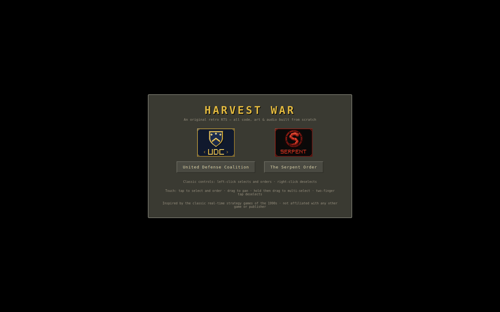
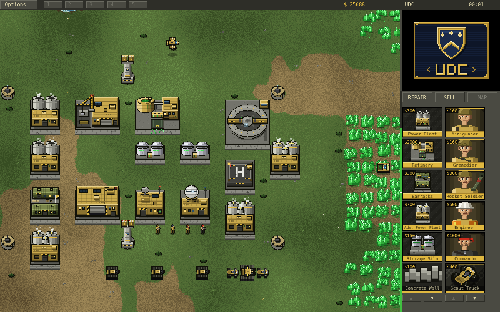
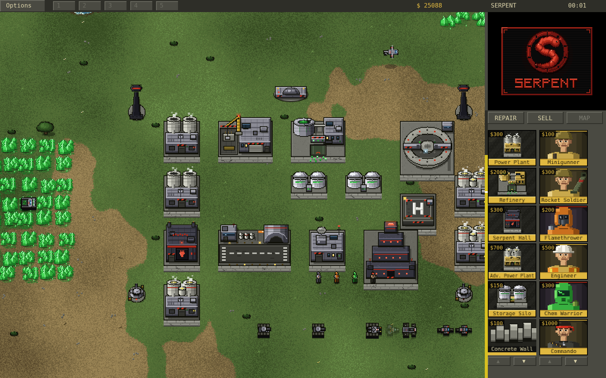
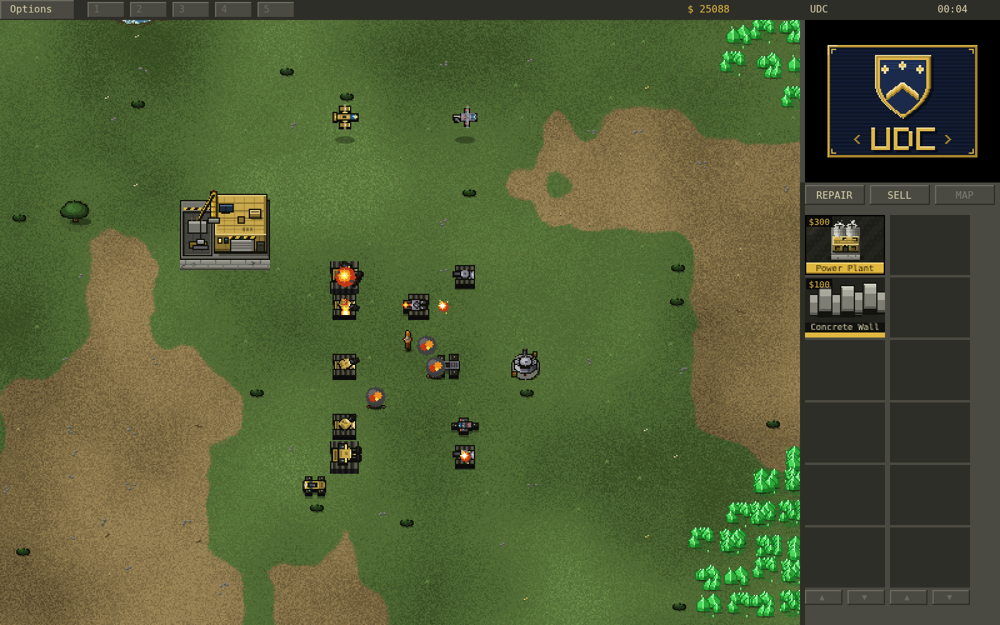
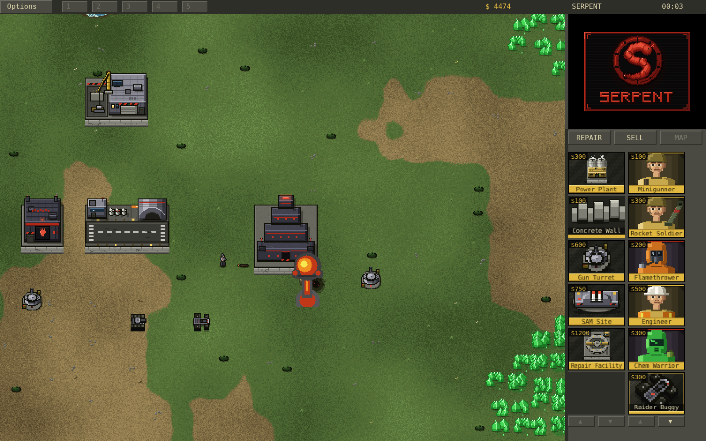
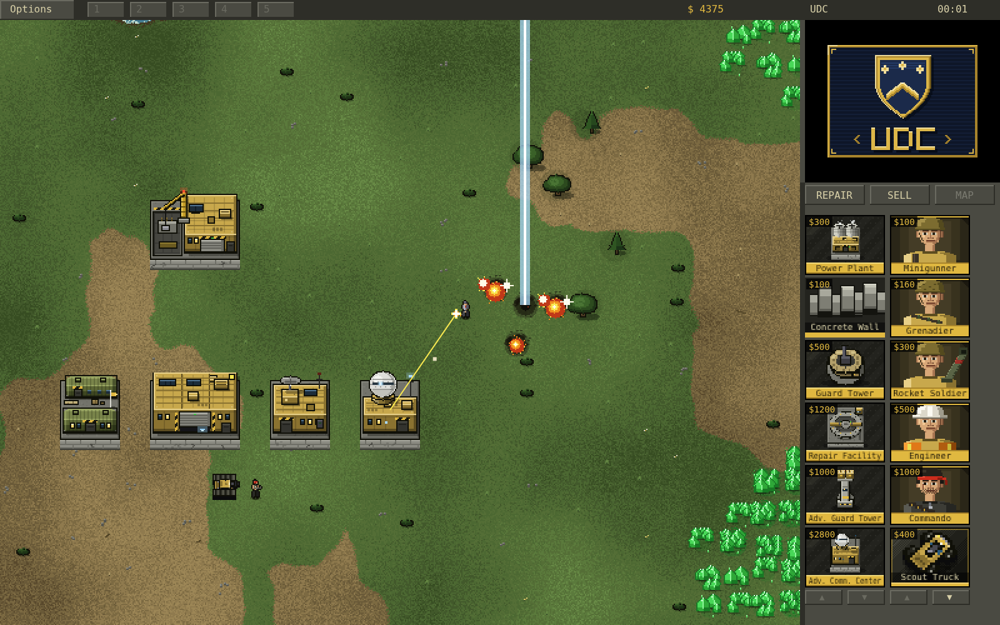

# Harvest War

An original, from-scratch, browser-based real-time strategy game in the
mid-90s style. All code, pixel art, and sound are **original** — the art is
drawn procedurally on canvases at load time and every sound, including the
tactical announcer and unit chatter, is synthesized live with WebAudio (no
recordings, no browser text-to-speech). Inspired by the classic RTS games of
the 1990s; not affiliated with, endorsed by, or connected to any other game
or publisher.

## Screenshots

| | |
|---|---|
|  |  |
|  |  |
|  |  |

## Running it

No build step, no dependencies. Serve the folder and open it:

```sh
cd cnc_fable5
python3 -m http.server 8000
# then open http://localhost:8000
```

(Opening `index.html` directly with `file://` also works in most browsers.)

Pick your side — United Defense Coalition or The Serpent Order — then pick
your battle: a **skirmish** on a random map, or one of five **campaign
operations**, each with its own briefing, fixed battlefield and objective
(annihilation, a harvest quota, a timed last stand, an economy hunt, and a
final assault). Winning an operation unlocks the next; progress is saved in
your browser. You start with an MCV: click it twice to deploy your
Construction Yard.

Handy URL parameters for testing: `?side=gdi&seed=42&nomenu=1&mute=1&mission=2`.

## Controls (classic 1995 scheme)

| Input | Action |
|---|---|
| Left-click | Select unit/building; with units selected: click ground = move, click enemy = attack, click chrysalite with a harvester = harvest |
| Left-drag | Band-box select units |
| Left-drag with a wall ready | Place a whole run of wall segments (extra segments charge on placement) |
| **Right-click** | **Deselect / cancel mode** (no right-click orders — classic-RTS convention) |
| Ctrl+click | Focus fire: force-attack ANY unit or building (friend, foe or neutral) |
| Shift+click | Add/remove from selection |
| Double-click | Select all visible units of that type |
| Click selected MCV (or `D`) | Deploy into Construction Yard |
| Select infantry, click a friendly APC | Board it (up to 5 passengers) |
| Click the selected loaded APC (or `U`) | Unload its passengers |
| Alt+1..9 (or Ctrl+1..9) | Assign control group — Alt is the reliable one; browsers steal Ctrl+1..8 for tab switching |
| 1..9 | Recall group (double-tap to center camera, Shift adds the group to the selection) |
| Tab-bar chips 1-5 | Click to recall that group (twice centers); right-click to assign the current selection |
| Click the selected factory again | Make it the primary factory for its kind (same as `P`) |
| `H` | Center on Construction Yard |
| `S` / `G` | Stop / guard |
| `T` | Select same type on screen |
| `P` | Set the selected factory building as primary for its kind |
| Arrow keys / screen edges | Scroll the map |
| Two-finger touchpad scroll (or mouse wheel) | Pan the map |
| `Esc` | Options menu / cancel placement, sell, repair, targeting |

### Touch (phones & tablets)

The game is playable from a mobile browser — landscape strongly recommended:

| Gesture | Action |
|---|---|
| Tap | Same as left-click: select, order, tap icons and buttons |
| One-finger drag | Pan the map (in placement mode it moves the building ghost instead; with a wall ready it draws the wall run; on the radar it scrubs the camera; on the build strips it scrolls them) |
| Long-press, then drag | Band-box select — touch boxes **add** to the current selection |
| Tap a unit already in a multi-selection | Drop it from the group (the Shift-click substitute) |
| Long-press a sidebar icon | Cancel/dequeue production (the right-click equivalent) |
| Tab-bar chips 1-5 | Tap to recall that control group (twice centers); long-press to assign the current selection |
| Two-finger tap | Deselect / cancel mode (the right-click equivalent) |
| Two-finger drag | Pan the map in any mode |
| Tap selected MCV again | Deploy into Construction Yard |
| Tap selected loaded APC again | Unload its passengers |
| Tap selected factory again | Make it the primary factory for its kind |

Small chrome controls (Options, REPAIR/SELL, strip arrows) accept
near-miss taps — a slop zone snaps them to the target. Edge scrolling
and the in-game cursor are mouse-only; on touch the pan gesture
replaces them.

On touch devices the layout adapts to the device's real aspect ratio:
the sidebar keeps its size on the right edge and the battlefield
viewport widens to use every pixel of screen width (desktop keeps the
classic fixed 16:10 frame).

**Getting rid of the mobile browser bar** works in three layers, since
no single mechanism covers every phone:

1. Picking a faction on a touch device requests fullscreen via the
   Fullscreen API (where the browser honors it).
2. If the address bar is still there, a **"Swipe up to hide the browser
   bar"** overlay appears — mobile browsers only collapse the bar in
   response to a real page scroll, which the game normally swallows, so
   this overlay lets exactly one swipe through as a genuine scroll. The
   page is kept one bar-height taller than the visible viewport for
   this purpose; once the bar collapses there is nothing left to scroll
   and the game locks the viewport again.
3. Best of all: the game is an installable **PWA** (manifest + service
   worker + icons). Use the *Install as App* button on the menu when
   the browser offers it, or *Add to Home Screen* — launched that way
   it runs truly fullscreen with no browser chrome at all, and works
   offline too.

The Options menu (`Esc` or the top-left tab) has a
**Fullscreen / Maximize Screen** button to redo any of this by hand.
Desktop mouse users never get fullscreen forced on them.

Sidebar: left icon strip is structures, right strip is units — every icon
shows its credit cost. Click an icon to start building (cost drains as it
builds, remaining time shows on the icon); click a finished structure icon to
place it. Unit icons can be clicked repeatedly to **queue up to 20 units**
(the badge shows the count) — a quality-of-life touch.
Infantry, vehicles, and aircraft each build on their own concurrent line, so
a Barracks and a War Factory (or Airstrip) run at the same time; owning more
than one factory of a kind speeds that line up, and `P` designates which one
new units spawn from. Left-click an in-progress structure icon to pause it,
right-click any icon to cancel/dequeue with refund. REPAIR and SELL buttons
toggle wrench/sell cursor modes. The radar comes online with a powered
Communications Center; owning more than one Advanced Comm. Center or Serpent
Temple charges the Orbital Lance / nuke proportionally faster.

## What's simulated

- **A painted world** — the ground is rendered per-pixel with world-space
  noise, so grass, dirt, water and rock blend into each other with ragged
  organic edges instead of tile seams; maps get a meandering river with
  fordable crossings and a timber bridge, an animated waterfall at the
  rocky rim, eroded mesa cliffs with wavy sun-caught lips, earthy strata,
  gullies and talus fans, forests with closed canopies and clearings, and
  scattered doodads (grass tufts, flowers, pebbles, cracks, bushes)
- **A campaign** — five operations per side with in-universe briefings and
  distinct objectives: annihilate an outpost, bank a chrysalite quota,
  survive a ten-minute onslaught, hunt down the enemy economy, and crack a
  fortress; each tunes the AI's aggression and war chest, wins unlock the
  next, and an objective chip on the HUD tracks live progress
- **A civilian hamlet** — farmhouse, cottages and a barn with villagers who
  wander about and flee gunfire; nobody auto-targets them (except the
  fleshlings), but Ctrl+click will
- **Original soundtrack** — four synthesized tracks in the dark mid-90s RTS
  style, sequenced live with WebAudio (each mission opens on a different
  one); toggle with Music: ON/OFF in the options menu
- **Feedback that feels good** — orders answer with collapsing green/red
  destination rings, hits flash white, harvest deliveries pop floating
  credit counters, and wounded buildings and vehicles trail smoke
- **Chrysalite economy** — harvesters (700 credits a load), refineries with
  docking, silos, storage caps, spreading chrysalite fields seeded by blossom
  trees, infantry take damage crossing fields
- **Power** — low power halves production speed, kills the radar, and disables
  the Beam Spire, Advanced Guard Tower, and SAM sites
- **Construction** — the classic sidebar with clock-wipe cameos, adjacency
  placement rules, incremental payment, hold/cancel with refund
- **Full roster** — Minigunner, Grenadier, Rocket Soldier, Flamethrower, Chem
  Warrior, Engineer (captures buildings), Commando; Scout Truck, Buggy, Recon Bike,
  APC (carries up to 5 infantry), Light/Medium/Behemoth/Flame/Stealth Tanks,
  Artillery, Rocket Launcher, Harvester, MCV; Kestrel and Gunship with helipad
  rearming; Serpent Order vehicles arrive by cargo plane at the Airstrip. The Behemoth
  Tank is visibly bigger than the rest and fires twin cannon shots.
- **Defenses** — Guard Tower, Advanced Guard Tower, Gun Turret, SAM Site, and
  the Beam Spire with its charge-up laser; concrete walls place in
  drag-runs, auto-connect, and block movement
- **Superweapons** — the UDC Orbital Lance (Advanced Comm. Center) and the Serpent Order's nuclear
  strike (Serpent Temple)
- **Combat details** — warhead vs. armor tables, turret rotation, homing
  rockets, artillery arcs, splash damage with friendly fire, tanks crush
  infantry underfoot when a move order paths over them, stealth tank
  cloaking, Behemoth self-repair
- **Pathfinding** — infantry bias their routes away from chrysalite (still
  crossable if it's the only way through); a chrysalite-free route always
  connects the two bases
- **Fog of war** — permanent-reveal black shroud, jagged edges, radar minimap;
  enemy blips on the radar need live line-of-sight from your own forces
- **Fleshlings** — infantry that die on a chrysalite field mutate into hostile
  creatures that attack everyone
- **Auto-repair** — damaged buildings start repairing themselves (toggleable
  with the REPAIR button); wading through chrysalite hurts infantry, standing
  still in it doesn't
- **Skirmish AI** — plans its base by role (power tucked behind, refineries at
  the chrysalite, defense arc facing you), keeps its economy and unit lines
  running, masses each attack at a staging point before striking on a
  sustained 2-4 minute cadence that scales up, garrisons its home, and fires
  its superweapon at your densest cluster
- **Tactical announcer & comms** — a synthesized in-universe radio voice
  (built live from oscillators + formant filters, never browser text-to-speech)
  calls out events — "Construction complete", "Unit ready", "Base under
  attack"… — with the message also shown on the HUD so nothing rides on the
  stylized voice; unit selection/orders answer with radio squelch + chatter.
  A **Voice: ON/OFF** toggle in the options menu silences it apart from the
  sound effects. Weapons, explosions and the soundtrack are all synthesized too.

## Not included (yet)

FMV, multiplayer, naval units, mid-mission save/load.

## Experimental: pre-rendered 3D sprite pipeline (unused)

`tools/render3d/` holds an experimental retro-style pipeline (low-poly
models rendered headlessly by Blender/Cycles into sprite sheets). The game
does not use it — all shipping art is the procedural pixel art.
